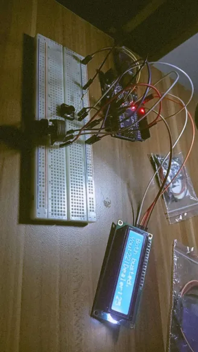
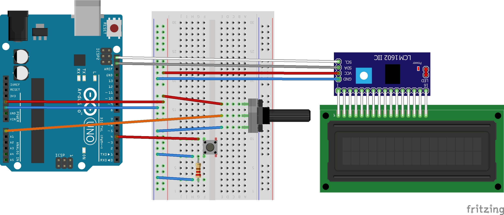

# Arduino Blackjack Game

Welcome to the Arduino Blackjack Game repository! This project brings the classic blackjack experience to life using an Arduino Uno, I2C LCD Module, Potentiometer, Push Button, and Wires. Engage in a strategic game of blackjack against the dealer, where your decisions and the dealer's logic determine the outcome.

## Overview

In this blackjack simulation, you, the player, interact with the game through a potentiometer to choose between "Stand" and "Hit." The potentiometer's analog data, ranging from 0 to 1023, guides your decision-making process. Analog values below 512 prompt a "Stand" choice, while values exceeding 512 signal a "Hit" option. The game unfolds on a clear I2C LCD display, providing real-time updates on scores and game progression.

## Gameplay

1. **Potentiometer Controls:**
   - Turn the potentiometer left to decrease analog input for "Stand."
   - Turn the potentiometer right to increase analog input for "Hit."

2. **Button Confirmation:**
   - Press and hold the button to confirm your selected action. Release the button once you've made your choice.

3. **Scoring:**
   - Exceeding 21 results in a bust, leading to the dealer's turn.
   - If both you and the dealer bust, it's a double bust.
   - Ties occur when both scores are equal.
   - To win, your score must surpass the dealer's without busting.
     
## System Logic

The game's logic revolves around the decision-making process driven by the player's interaction with the potentiometer and button. The potentiometer sends analog data, and the system interprets this data to determine the player's choice. Here's a breakdown of the system's logic:

- **Potentiometer Input:**
  - The potentiometer generates analog values ranging from 0 to 1023.
  - Values below 512 are interpreted as a "Stand" decision.
  - Values exceeding 512 are interpreted as a "Hit" decision.

- **Button Confirmation:**
  - Once the player has chosen "Stand" or "Hit" using the potentiometer, they confirm their decision by pressing the button.

- **Scoring and Game Flow:**
  - If the player's score exceeds 21 after a "Hit," the player busts, and it becomes the dealer's turn.
  - If both the player and the dealer bust, it results in a double bust.
  - Ties occur when both player and dealer scores are equal.
  - To win, the player's score must be higher than the dealer's without exceeding 21.

## Images

*Caption: A screenshot of the blackjack game in action.*

### Circuit Diagram

*Caption: Circuit diagram illustrating the wiring of components.*

## Setup

### Components:
- Arduino Uno
- I2C LCD Module
- Potentiometer
- Push Button
- Wires

### Wiring:
- Button: Connect to digital out pin 4 and ground pin.
- Potentiometer: Connect the center pin to A0, and connect VCC and Ground.
- I2C LCD: Connect to Ground, VCC, SCL, and SDA.

### Installation:
1. Connect the components based on the provided wiring diagram.
2. Upload the Arduino code to the board.

## External Library:

This project uses the `LiquidCrystal_I2C` library for I2C communication with the LCD display. To make it convenient for you, the library files are included in this repository under the `libraries` folder. When setting up your Arduino environment, make sure to include these library files.

### Library Files:

- [LiquidCrystal_I2C](libraries/LiquidCrystal_I2C.zip)

To include the library in your Arduino project, follow these steps:

1. Open the Arduino IDE.
2. Go to Sketch -> Include Library -> Add .ZIP Library.
3. Select the `libraries` folder from this repository.
4. Choose the `LiquidCrystal_I2C.zip` file and click "Open."

Now, you're all set to use the `LiquidCrystal_I2C` library in your Arduino project.
